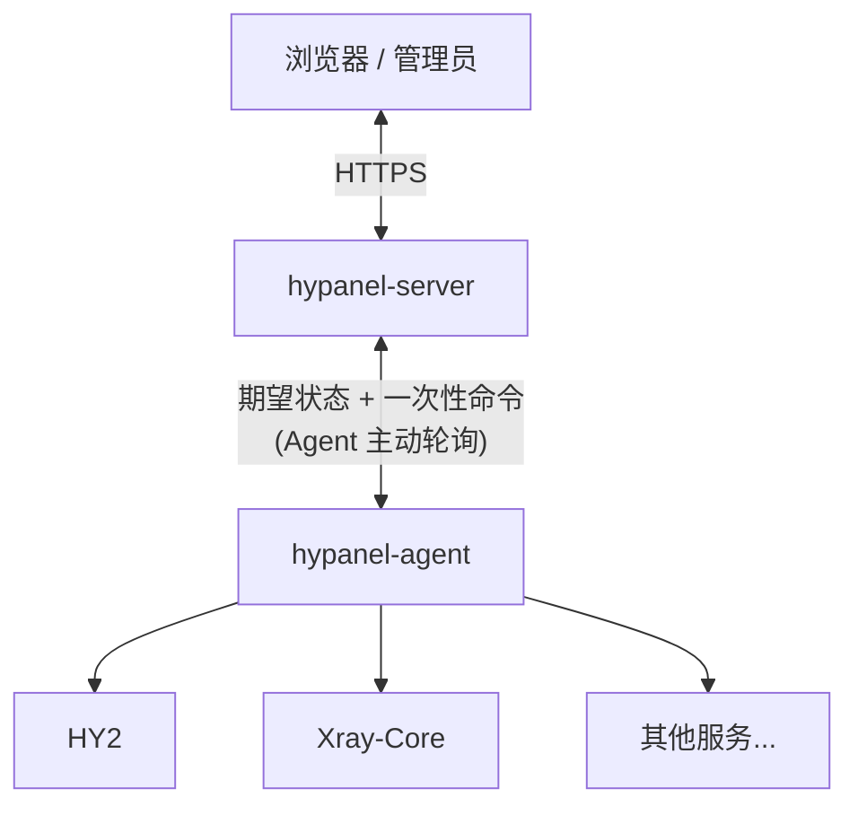

<p align="center">
  <picture>
    <source media="(prefers-color-scheme: dark)" srcset="assets/logo-dark.svg">
    
  </picture>
</p>

# HyPanel

一个面板集中管理多台节点上的 Hysteria2 / Xray 代理服务，节点一条命令接入，用户和订阅统一分发。

## 核心功能

- **多节点、多服务**：一个面板管理多台节点，每台节点可同时运行 Hysteria2、Xray REALITY、Shadowsocks 2022 等多个服务。
- **一键接入**：一条命令安装 Agent，节点主动连接面板，无需开放管理端口；卸载同样一条命令。
- **用户与订阅**：按用户组分配服务，支持流量上限、到期时间和每月重置；订阅为 Clash / Mihomo 格式，自带分流规则。
- **证书管理**：支持手动上传、路径映射和 ACME 自动续期，证书更新后自动下发到节点。
- **自动更新与备份**：面板、Agent 和代理内核都可在线更新，失败自动回滚；支持在线备份与恢复。
- **轻量部署**：Server 和 Agent 都是单个可执行文件。

## 架构



## 快速开始

在一台 Linux x64 服务器上下载并运行面板（其他架构见 [Releases](https://github.com/greepar/HyPanel/releases)）：

```bash
mkdir -p /opt/hypanel && cd /opt/hypanel
curl -fsSL https://github.com/greepar/HyPanel/releases/download/v0.5.1/hypanel-server-0.5.1-linux-x64.tar.gz | tar -xz

# 生成并保存两个密钥：MasterKey 用于加密凭据，之后不能再改
cat > server.env <<EOF
HYPANEL_ADMIN_TOKEN=$(openssl rand -hex 32)
HYPANEL_MASTER_KEY=$(openssl rand -base64 32)
EOF

set -a; . ./server.env; set +a
ASPNETCORE_URLS=http://0.0.0.0:8080 ./hypanel-server
```

打开 `http://服务器IP:8080`，用 `server.env` 里的 `HYPANEL_ADMIN_TOKEN` 创建管理员，然后在“节点”页新建节点，复制安装命令到
节点服务器上运行即可。

以 systemd 常驻运行、配置 HTTPS、添加服务和用户等，请看 **[使用文档](https://greepar.github.io/HyPanel/)**。

## 开发

需要 [`global.json`](global.json) 指定的 .NET SDK、Node.js 22+，发布时还需要 NativeAOT 工具链（交叉编译由
StuDev.AotAnywhere 自动下载 zig）。

```bash
npm ci --prefix web/HyPanel.Web
dotnet build HyPanel.slnx -c Release
dotnet test HyPanel.slnx -c Release --no-build
npm run build --prefix web/HyPanel.Web
dotnet publish src/HyPanel.Server/HyPanel.Server.csproj -c Release -r linux-x64
dotnet publish src/HyPanel.Agent/HyPanel.Agent.csproj -c Release -r linux-x64
```

Linux 版 Server 发布时会下载固定版本的 SQLite 源码（校验 SHA256）并静态链接。

## 许可证

HyPanel 使用 [GNU General Public License v3.0](LICENSE) 授权。
