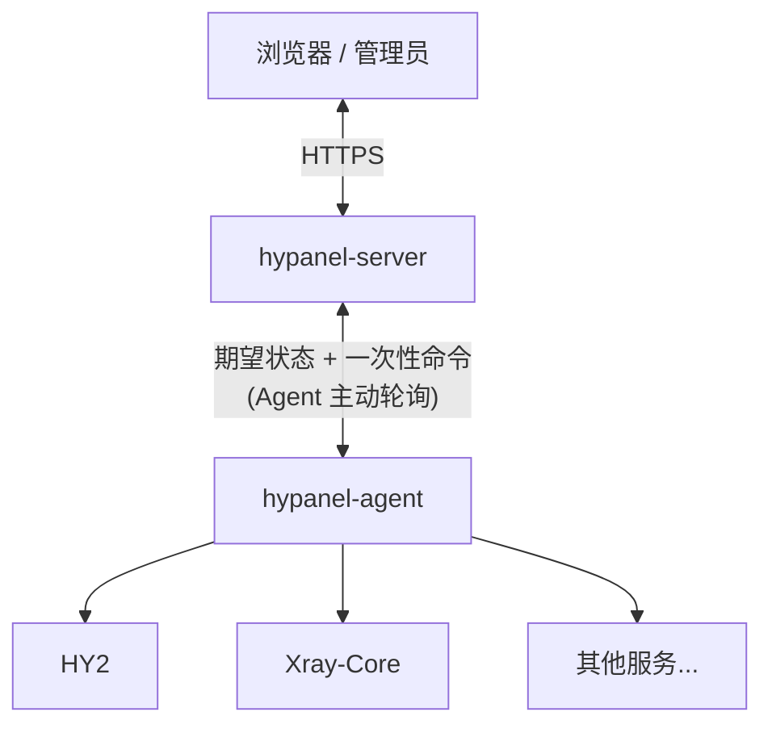

<p align="center">
  <picture>
    <source media="(prefers-color-scheme: dark)" srcset="assets/logo-dark.svg">
    
  </picture>
</p>

# HyPanel

一个面板集中管理多台节点上的 Hysteria2 / Xray 代理服务，节点一条命令接入，用户和订阅统一分发。

## 核心功能

- **多节点、多服务**：一个面板管理多台节点，每台节点可同时运行 Hysteria2、Xray REALITY、Shadowsocks 2022 等多个服务。
- **一键接入**：一条命令安装 Agent，节点主动连接面板，无需开放管理端口；卸载同样一条命令。
- **用户与订阅**：按用户组分配服务，支持流量上限、到期时间和每月重置；订阅为 Clash / Mihomo 格式，自带分流规则。
- **证书管理**：支持手动上传、路径映射和 ACME 自动续期，证书更新后自动下发到节点。
- **自动更新与备份**：面板、Agent 和代理内核都可在线更新，失败自动回滚；支持在线备份与恢复。
- **轻量部署**：Server 和 Agent 都是单个可执行文件。

## 架构



## 快速开始

推荐用 Docker Compose 启动 Server。先生成并妥善保存两个密钥：

```bash
export HYPANEL_ADMIN_TOKEN="$(openssl rand -hex 32)"
export HYPANEL_MASTER_KEY="$(openssl rand -base64 32)"
```

`HYPANEL_MASTER_KEY` 用于加密代理凭据和证书私钥，安装后必须长期保持不变。

创建 `compose.yml`：

```yaml
services:
  hypanel:
    image: ghcr.io/greepar/hypanel:latest
    restart: unless-stopped
    ports:
      - "8080:8080"
    environment:
      HYPANEL_ADMIN_TOKEN: ${HYPANEL_ADMIN_TOKEN:?required}
      HYPANEL_MASTER_KEY: ${HYPANEL_MASTER_KEY:?required}
    volumes:
      - hypanel-data:/data

volumes:
  hypanel-data:
```

启动：

```bash
docker compose up -d
```

打开 `http://SERVER_IP:8080`。首次使用时登录页会显示“创建管理员”，填入 `HYPANEL_ADMIN_TOKEN` 以及新管理员的用户名和
密码即可；之后这个入口会自动关闭。接入公网节点之前，请先把 Server 放到 HTTPS 反向代理之后。

## Docker

镜像提供 `linux/amd64` 和 `linux/arm64`，以非 root 用户运行，监听 8080 端口，持久数据位于 `/data`。不要把 Docker
socket 挂载进 HyPanel。

Docker 部署由运维者自行更新：

```bash
docker compose pull
docker compose up -d
```

面板会提示有新版本，但在容器内不会替换自身的可执行文件。

## 裸机部署 Server

从 [GitHub Releases](https://github.com/greepar/HyPanel/releases) 下载并部署


## 开发

需要 [`global.json`](global.json) 指定的 .NET SDK、Node.js 22+，发布时还需要 NativeAOT 工具链（交叉编译由
StuDev.AotAnywhere 自动下载 zig）。

```bash
npm ci --prefix web/HyPanel.Web
dotnet build HyPanel.slnx -c Release
dotnet test HyPanel.slnx -c Release --no-build
npm run build --prefix web/HyPanel.Web
dotnet publish src/HyPanel.Server/HyPanel.Server.csproj -c Release -r linux-x64
dotnet publish src/HyPanel.Agent/HyPanel.Agent.csproj -c Release -r linux-x64
```

Linux 版 Server 发布时会下载固定版本的 SQLite 源码（校验 SHA256）并静态链接。

## 许可证

HyPanel 使用 [GNU General Public License v3.0](LICENSE) 授权。
